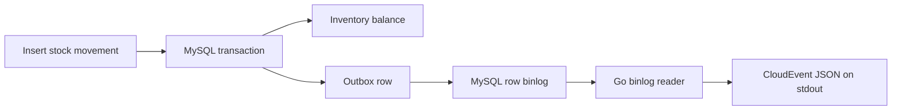

# Go Legacy CDC Lab

**A runnable, synthetic slice of a legacy inventory integration.** A MySQL transaction writes a stock movement, updates its balance, and inserts an outbox event. A Go process reads the row-based binlog and converts the event into CloudEvents JSON. No customer code, records, schema, or credentials are used.

This repository demonstrates a specific architecture decision: capture committed changes from the binlog instead of repeatedly querying an outbox table. The current executable slice prints the CloudEvent. Durable broker delivery, GTID checkpointing, replay, and an idempotent read model are specified below and remain to be implemented.

## Run in two minutes

Requires Go 1.23+ and Docker Compose.

```bash
make up
make demo
make test
make down
```

`make demo` inserts one synthetic movement and prints a CloudEvent. Each run reduces the seeded `DEMO-001` balance by one; `make down` removes the local database volume and resets the demo. The database is bound to `127.0.0.1:3307` and uses local demo passwords. Never reuse them in a deployed environment.

Example output (IDs vary):

```json
{"specversion":"1.0","id":"...","source":"/synthetic-legacy/inventory","type":"inventory.stock-moved.v1","subject":"DEMO-001","datacontenttype":"application/json","data":{"actor_id":"demo-operator","delta":-1,"location_code":"A-01-02","movement_id":1,"sku":"DEMO-001"},"originsequence":1}
```

## Current architecture



The trigger is useful here because it leaves the synthetic legacy writer unchanged. A production integration would evaluate whether this coupling is acceptable for the source system. The outbox insert and balance update succeed or roll back together. The demo starts at the current file position and only captures its new event; it is **not a durable CDC service yet**.

## What the portfolio should prove next

| Milestone | Evidence a reviewer can inspect | Status |
| --- | --- | --- |
| Atomic source change + outbox | Schema, trigger, rollback test | Implemented |
| Binlog to CloudEvents | Go reader and executable demo | Implemented |
| Resume after crash | Durable GTID checkpoint and replay test | Planned |
| Delivery under broker failure | RabbitMQ publisher confirms and retry test | Planned |
| Idempotent projection | Unique event ID, transactional read model, duplicate test | Planned |
| Operability | Lag and error metrics, trace IDs, bounded queue, runbook | Planned |
| Performance | Reproducible benchmark, resource limits, graphs | Planned |

See [specification](docs/spec.md), [implementation plan](docs/plan.md), [task list](docs/tasks.md), and [ADR 0001](docs/adr/0001-binlog-outbox.md). Those are the Spec-Driven Development record; the tests and demo are evidence, not substitutes for the spec.

## Why this project is relevant

The project connects to Raúl Almeida's published writing on [the polling tax](https://raulalmeidablog.substack.com/p/the-polling-tax-how-to-decouple-legacy), [the Go streamer](https://raulalmeidablog.substack.com/p/building-the-go-streamer-reading), [CloudEvents](https://raulalmeidablog.substack.com/p/from-binlog-to-cloudevents-building), and [idempotent consumers](https://raulalmeidablog.substack.com/p/idempotent-consumers-anti-corruption). It is a fresh educational implementation inspired by those patterns, not the production system or a claim that these exact files ran at a client.

## Interview prompts

1. What failure occurs if a broker publish succeeds but a checkpoint write fails? Explain the resulting duplicate and the consumer's defense.
2. What if MySQL purges a binlog before a stopped consumer resumes? Define recovery and alerting, including the data loss boundary.
3. How would you preserve per-SKU ordering when increasing throughput? Show the tradeoff with parallelism.
4. Why can an outbox trigger be appropriate for a legacy writer, and when would its write cost be unacceptable?
5. Which measurements would establish that binlog CDC beats polling for this workload? Include p95 latency, load on the source database, and recovery time.

## Development notes

- `go test ./...` covers event parsing and mapping. `INTEGRATION=1 go test ./...` additionally checks transactional rollback against the local MySQL container.
- `go test -race ./...` runs Go's race detector.
- `make down` deletes the demo database volume.
- Before presenting this as a production-ready reference: choose a license; complete the planned reliability slice and record a short screencast. CI runs the unit, race, integration and end-to-end demo checks on each push.
